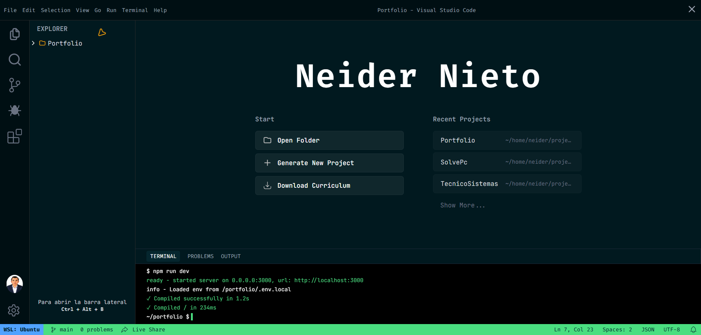

<!-- HEADER BANNER: DISEÑO TRANSPARENTE Y TIPOGRÁFICO -->

  

<!-- TYPING ANIMATION -->

 
 

<!-- SOCIAL ICONS: SKILL ICONS (MINIMALISTAS) -->

  
  &nbsp;&nbsp;
  
  &nbsp;&nbsp;
  
  &nbsp;&nbsp;
  

---

## Sobre Mí

Soy Neider Nieto, Ingeniero de Sistemas y Desarrollador Full-Stack radicado en Colombia.

Me especializo en el diseño y desarrollo de plataformas web modernas, robustas y de alto rendimiento. Mi enfoque técnico se centra en la construcción de interfaces inmersivas, garantizando un código estructurado, escalable y mantenible.

"La calidad del código se refleja en la claridad de su arquitectura y en la experiencia de quienes interactúan con él."

---

## Sobre el Proyecto: Portfolio Interactivo

Este repositorio contiene el código fuente de mi portfolio profesional: **[https://www.neider.dev](https://neider.dev)**.

La plataforma fue diseñada rompiendo el esquema tradicional del currículum estático. Se estructuró conceptualmente como un entorno de desarrollo (IDE), permitiendo una navegación técnica por archivos y pestañas para consultar proyectos, experiencia e información de contacto.

### Interfaz del Portfolio

A continuación, se presenta una vista general de la arquitectura visual del proyecto.

  

 

### Características Principales

*   **Arquitectura de Interfaz:** Explorador de archivos dinámico, gestión de pestañas con estado persistente y terminal integrada. La navegación actualiza dinámicamente el encabezado para reflejar el archivo o pestaña activa.
*   **Rendimiento y SSR:** Implementación de Server-Side Rendering mediante Astro, complementado con islas interactivas en React.
*   **Gestión de Estado Centralizada:** Sincronización de componentes en tiempo real utilizando Nano Stores.
*   **Integración de Datos:** Conexión directa con Supabase para el procesamiento seguro de formularios y gestión de estado.

---

## Stack Tecnológico

| Core y Frontend | Backend y Bases de Datos | Herramientas y Despliegue |
|:---:|:---:|:---:|
|  |  |  |
| Astro, React, Tailwind CSS, TypeScript | Node.js, Express, PostgreSQL, Supabase | Git, GitHub, Vercel, Docker |

---

## Proyectos Destacados

Selección de plataformas desarrolladas aplicando principios de arquitectura Full-Stack y diseño de interfaces avanzadas:

| Proyecto | Descripción | Tecnologías Principales |
|:---|:---|:---|
| **[InfoByte](https://neider.dev)** | Asistente conversacional de inteligencia artificial enfocado en soporte tecnológico con respuestas en tiempo real. | React, Node.js, OpenAI, Tailwind |
| **[SolvePC](https://neider.dev)** | Software de administración para talleres de hardware. Control de órdenes, clientes y actualización de stock. | React, Node.js, PostgreSQL, Docker |
| **[Inventario App](https://neider.dev)** | Sistema analítico para control de inventarios, generación de reportes y emisión de alertas de stock. | React, Node.js, Express, MySQL |
| **[Real-Time Chat](https://neider.dev)** | Aplicación de mensajería síncrona con arquitectura de WebSockets, autenticación y gestión de salas. | React, Socket.io, Node.js, MongoDB |

Para explorar la totalidad del código fuente o revisar detalles de implementación técnica, visite mis repositorios o el entorno en vivo.

---

## Contacto Profesional

Si desea discutir oportunidades de desarrollo, arquitecturas de software o propuestas de colaboración técnica, los canales de comunicación se encuentran abiertos.

  
  
  &nbsp;&nbsp;
  
  &nbsp;&nbsp;
  

 

 
 

<!-- FOOTER BANNER -->

Desarrollado bajo principios de código limpio · 2026 Neider Nieto · Licencia MIT

